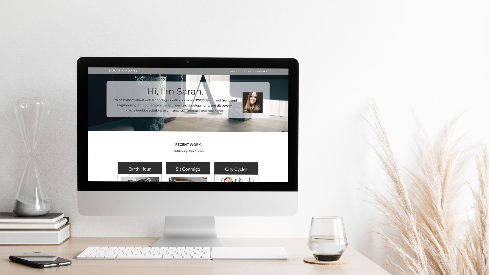

<h1><a href="https://www.sarahkadams.com"><strong>Sarah K Adams</strong></a></h1>

<h2>UX/UI Design & Front-End Development Portfolio Website</h2>

<h4>Built Using:</h4>

* HTML & CSS
* Bootstrap Framework
* JavaScript (jQuery)

Purpose: A portfolio website to display my design and development work, introduce my skill set, favorite technology tools, personality and values to potential clients, and provide social links for people to connect with me through.

Design: The color scheme was rendered in neutral gray monochrome and the theme was personalized with imagery, iconography, and reusable card components for portfolio projects. The About page introduces me, my skill set, and values.

